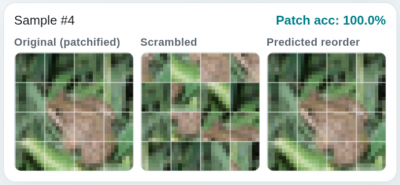
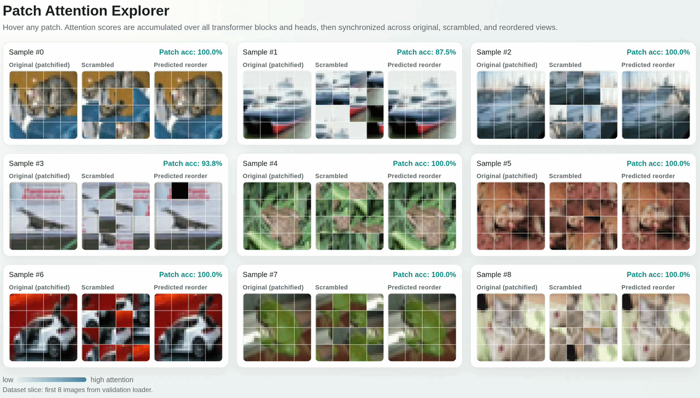

# Solving Puzzles with Transformer

This assignment studies how Transformer attention can be used for vision tasks.

You will train a model that receives scrambled image patches and predicts where each patch came from in the original image. Finally you can use an interactive tool to inspect the attention weights of your model (see video below).



## Scope

You are given a training scaffold and an attention exploration tool.
Your main work is to complete the model-building and patch-processing components in [main.py](main.py).


> If you prefer to work without Weights and Biases (for example while you are debugging) you can run `wandb disabled` in your terminal to turn off all its functionalities (or `wandb enabled` to turn it back on).

## High-Level Problem Formulation

For each image:
- Convert the image into a sequence of patch tokens.
- Each token is a flattened 8x8 image patch.
- Shuffle the patch tokens.
- Predict an original position label for every shuffled token.

This is a token-level classification problem, not image generation. We don't ask the model to predict the original image pixels but rather a sequence of indices that we can use to reorder the scrambled patches to reconstruct the original image. This task is much easier to solve.

Model input (conceptually):
- A sequence of scrambled patch vectors $(B, N, P\times P)$, in our case: $(B, 16, 8 \times 8)$.

Model output (conceptually):
- For each token (e.g., patch), a categorical distribution over all possible original grid positions $(B, N, N)$.

Why this formulation is used:
- It is simple to train with cross-entropy.
- It gives direct, interpretable token-wise predictions.
- It makes attention patterns easy to inspect.

Primary modeling consideration:
- Independent token classification does not strictly enforce a valid one-to-one permutation. E.g., the model can predict that two puzzle pieces will fall onto the same spot.
- This tradeoff is intentional for this assignment to keep the setup focused and tractable.

## Suggested Workflow

1. Implement the required TODO/NotImpelemented sections in [main.py](main.py).
2. Run training and verify metrics/logs. You should reach >70% full puzzle accuracy on the validation split.
3. Use the interactive attention webpage to inspect model behavior (see below).
4. Summarize findings and failure cases.

Patch sanity assertions are included directly in [main.py](main.py) as assert_patch_roundtrip.

## Attention Explorer

[attention.py](attention.py) generates an interactive webpage that synchronizes original, scrambled, and reordered views and overlays accumulated attention on hover.

Generate the page:

```bash
python attention.py --num-images 9 --run-dir wandb/YOUR-RUN/files
```


> Try it yourself, this is how it should also look for you when you regenerate it: [attention_viewer.html](attention_viewer.html)

## Useful API References

These are the most helpful building blocks used in the implementation:

- PyTorch unfold: https://pytorch.org/docs/stable/generated/torch.Tensor.unfold.html
- PyTorch permute: https://pytorch.org/docs/stable/generated/torch.permute.html
- PyTorch view/reshape: https://pytorch.org/docs/stable/generated/torch.Tensor.view.html
- PyTorch MultiheadAttention: https://pytorch.org/docs/stable/generated/torch.nn.MultiheadAttention.html
- PyTorch LayerNorm: https://pytorch.org/docs/stable/generated/torch.nn.LayerNorm.html
- PyTorch cross_entropy: https://pytorch.org/docs/stable/generated/torch.nn.functional.cross_entropy.html
- PyTorch AdamW: https://pytorch.org/docs/stable/generated/torch.optim.AdamW.html
- W&B PyTorch integration: https://docs.wandb.ai/models/integrations/pytorch

## Attention Discussion

1. Can you spot any attention patterns?
2. How does attention deal with ambiguous patches (e.g., very similar patches)?
3. Can you find any other interesting interactions?


## Taking Puzzle Solving to the Next Step
What limitations in our pipeline can you spot?
- Surely, it would be great to enforce predicting valid puzzle permutation such that every position is only predicted once. This can be solved through bipartite matching. [Hungarian matching](https://towardsdatascience.com/hungarian-algorithm-and-its-applications-in-computer-vision/) is one of the most commonly used algorithms to find the best bipartite matching. This would allow you to find a valid permutation that maximizes the certainty of your model.
- The current model is not really a Transformer, it only uses self-attention. Try to implement the full Transformer architecture with encoder and decoder. Will this achieve better results? Either implement it yourself from scratch or you can check out PyTorchs implementations if you are just curious ([Transformer](https://docs.pytorch.org/docs/stable/generated/torch.nn.Transformer.html), [TransformerEncoder](https://docs.pytorch.org/docs/stable/generated/torch.nn.TransformerEncoder.html), [TransformerDecoder](https://docs.pytorch.org/docs/stable/generated/torch.nn.TransformerDecoder.html)). This will help you understand how to use the Transformer, intricate attention mechanisms and masking.